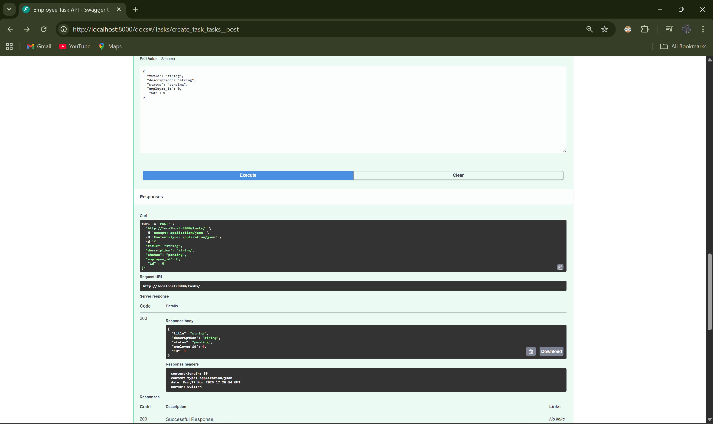
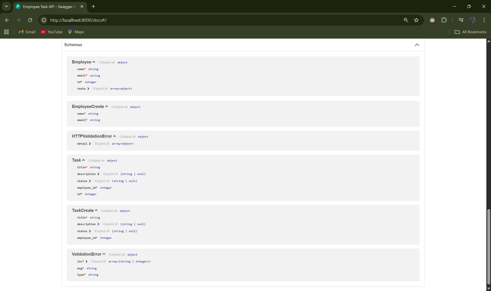

                                Employee Task Manager API

A simple FastAPI + SQLite backend for managing Employees and Tasks using RESTful APIs.

This project demonstrates:

API development

Database CRUD operations

Clean folder structure

ORM usage (SQLAlchemy)

Auto-generated API documentation via Swagger
(Download the zip and extract using any unzip tool.)

🚀 Tech Stack Used:

Backend:

Python 3.10+

FastAPI – API framework

Uvicorn – ASGI server

SQLAlchemy – ORM for database operations

Pydantic – Data validation

Database:

SQLite (file-based, zero config)

Tools:

Swagger UI (built-in with FastAPI for testing)

📂 Project Structure:
employee_task_api/
│
├── app/
│   ├── main.py
│   ├── database.py
│   ├── models.py
│   ├── schemas.py
│   ├── crud.py
│   ├── routers/
│   │   ├── employees.py
│   │   └── tasks.py
│   └── __init__.py
│
├── employee_tasks.db   (auto-created)
├── requirements.txt
└── README.md

🛠️ Setup Steps:
1. Clone the repository
git clone ProU_Technology_Backend_Track_2
cd employee_task_api

2. Create and activate virtual environment
python -m venv venv
source venv/bin/activate     # Mac/Linux
venv\Scripts\activate        # Windows

3. Install dependencies
pip install -r requirements.txt

4. Run the backend
uvicorn app.main:app --reload

5. Open API documentation (Swagger UI)

👉 http://localhost:8000/docs

🧪 API Endpoints
👤 Employees
Method	        Endpoint	        Description
GET	            /employees	        Get all employees
POST	        /employees	        Create employee
GET	            /employees/{id}	    Get one employee
DELETE	        /employees/{id}	    Delete employee

📝 Tasks
Method	        Endpoint	        Description
GET	            /tasks	            Get all tasks
POST	        /tasks	            Create task
GET	            /tasks/{id}	        Get one task
DELETE	        /tasks/{id}	        Delete task

## 🌐 Swagger UI - Overview

FastAPI provides an interactive API documentation interface at:
http://localhost:8000/docs

This Swagger UI allows you to:
- View all available endpoints
- See each endpoint’s request/response format
- Execute API calls directly from the browser
- Test payloads without Postman
- Inspect responses and errors

The screenshot below shows the **Swagger UI home screen**, which loads automatically when the backend is running.

 **Swagger UI Screenshot**:

## 📝 Task Creation API (POST /tasks)

Below is an example of creating a new task using Swagger UI:

### ✔ Response Example
- Status: **200 OK**
- Response Body:
json
{
  "title": "string",
  "description": "string",
  "status": "pending",
  "employee_id": 0,
  "id": 0
}

API Schema (FastAPI Models Overview):

This screenshot shows the automatically generated **API Schema** from FastAPI.  
It defines all the Pydantic models used by the backend for validation and response formatting.

API Schema Screenshot:

These schema models include:

    Employee
Represents a stored employee with:
- `id`
- `name`
- `email`
- `department`

### EmployeeCreate
Used only when creating a new employee:
- `name`
- `email`
- `department`

### Task
Represents a stored task with:
- `id`
- `title`
- `description`
- `status`
- `employee_id`

### TaskCreate
Used only when creating a new task:
- `title`
- `description`
- `status`
- `employee_id`

### ValidationError / HTTPValidationError
FastAPI models for validation handling when invalid input is sent.

 

